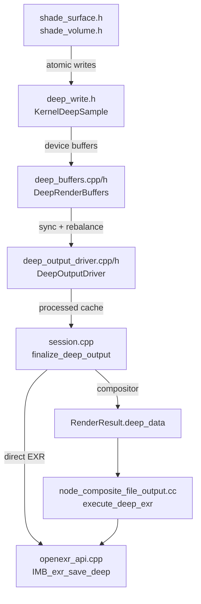

# Deep EXR Code Review — Round 4

> **Date:** 2026-02-13  
> **Commit:** `05569de1e` (squashed) + uncommitted `session.cpp` multi-view guard  
> **Scope:** 46 files, +2865/−20 lines  
> **Prior rounds:** Round 1–3 issues resolved (type safety, function decomposition, magic numbers, comment style, `ccl::vector`)

---

## Overall Assessment: ✅ Merge-Ready (with minor cleanup)

The implementation is well-architected and production-quality. The squashed commit is clean, `.gitignore` no longer contains agent entries, and the multi-view guard addresses the last verified finding. Two minor code quality items remain.

---

## Architecture Overview



---

## Issues Found

### 🟡 Moderate — Draft Comments in `light_passes.h`

[film_write_surface_emission()](file:///E:/blender_modify/blender/intern/cycles/kernel/film/light_passes.h#L679) contains in-progress thinking comments that read like development notes rather than documentation:

```cpp
     /* Reconstruct world P to calculate Z depth??
        Or does isect.t correspond to z-depth? No, ray distance.
        So we need world P.
        We can't easily get P here without re-computing from ray?
        Ray is in state.
     */
```

**Fix:** Replace the question-style comments with a concise rationale:
```cpp
     /* Reconstruct surface P from ray origin + direction * intersection distance. */
```

---

### 🟡 Moderate — Empty TODO Block in `light_passes.h`

[film_write_combined_transparent_pass()](file:///E:/blender_modify/blender/intern/cycles/kernel/film/light_passes.h#L399) has an empty conditional with a TODO comment that compiles as dead code:

```cpp
#ifdef __DEEP_OUTPUT__
  if (kernel_data.film.use_deep_output) {
      /* TODO: Retrieve pixel index and depth? ... */
  }
#endif
```

**Fix:** Either implement the transparent-surface deep write or remove the block entirely. If background/holdout deep samples are intentionally skipped, a simple comment suffices:
```cpp
/* Deep output: background and holdout are not captured as deep samples. */
```

---

### 🟢 Minor — Trailing Whitespace

Several lines in `shade_volume.h` and `openexr_api.cpp` have trailing spaces (visible in the diff as lines ending with extra whitespace). Most Blender development guidelines require clean line endings.

**Affected files:**
- [shade_volume.h](file:///E:/blender_modify/blender/intern/cycles/kernel/integrator/shade_volume.h) — ~6 lines with trailing spaces
- [openexr_api.cpp](file:///E:/blender_modify/blender/source/blender/imbuf/intern/openexr/openexr_api.cpp) — ~4 lines with trailing spaces

---

### 🟢 Minor — LF vs CRLF Line Endings

Git reports LF→CRLF warnings on 6 files. These are new files created on Windows with LF endings:

```
session.cpp, shade_volume.h, deep_buffers.cpp, deep_buffers.h,
deep_output_driver.cpp, deep_output_driver.h
```

Not a blocker — git autocrlf handles this — but for consistency, consider normalizing line endings before final push.

---

### 🟢 Minor — Extra Blank Lines in `shade_volume.h`

Two consecutive blank lines at [line 2418-2419](file:///E:/blender_modify/blender/intern/cycles/kernel/integrator/shade_volume.h#L2418) in `volume_integrate_ray_marching()`:

```cpp
  Spectrum accum_emission = zero_spectrum();


  for (int step = 0; ...
```

Delete one blank line.

---

## What's Done Well

| Area | Quality |
|------|---------|
| **Type safety** | `RenderDeepData*` replaces `void*` everywhere — `RE_deep_data.hh`, `RE_pipeline.h`, `COM_render_context.hh`, `render_result.cc`, `session.cpp`, `node_composite_file_output.cc` |
| **Function decomposition** | `DeepOutputDriver` has 14 well-named private methods; no function exceeds ~80 lines |
| **Named constants** | `constexpr float deep_alpha_epsilon`, `deep_memory_headroom_bytes`, `deep_volume_depth_epsilon`, `deep_segment_alpha_epsilon` |
| **Overflow protection** | `compute_deep_bytes()` has exhaustive `size_t` multiplication overflow checks |
| **Rebalance preservation** | Snapshot/restore pattern in `sync_device_buffers()` correctly handles CPU+GPU work redistribution |
| **Deep Recolor** | Log-domain alpha scaling in `compute_scaled_alphas()` with 4 fallback strategies |
| **Volume handling** | Per-segment alpha via transmittance ratio tracking (unbiased mode) and physical transmittance (ray-marched mode) |
| **EXR I/O** | Per-scanline approach in `IMB_exr_save_deep()` minimizes peak memory; deep-safe compression restricted to NONE/RLE/ZIPS |
| **Multi-view guard** | `session.cpp` now blocks deep output for multi-view with `RE_engine_report()` error |
| **DNA/RNA** | Clean integration: `R_IMF_IMTYPE_DEEP_EXR = 37`, codec filtering, versioning in `versioning_510.cc` |
| **Compositor** | `node_composite_file_output.cc` adds independent deep merge with same algorithm as Cycles-side `deep_buffers.cpp` |
| **`.gitignore`** | Agent entries removed (only trailing newline change remains) |

---

## Recommendation

**Merge after fixing the 2 moderate items** (draft comments + empty TODO block). The minor items (trailing whitespace, blank lines, line endings) can be fixed in a follow-up cleanup.
