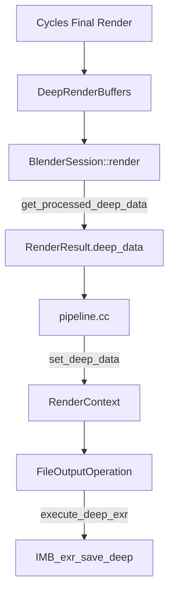

# Deep EXR Compositor File Output - Implementation Plan

> **Goal**: Enable Deep EXR output through the Compositor File Output node.

> [!NOTE]
> **STATUS: ✅ COMPLETE (2026-01-19)**
> Deep EXR output now works through compositor File Output node.
> Auto-enables when compositor has DEEP_EXR File Output.

---

## Implementation Summary

### What Was Implemented

1. **RenderResult Storage**: Added `deep_data`, `deep_width`, `deep_height`, `deep_data_owned` fields to store deep samples after render.

2. **Cycles Integration**: Modified `BlenderSession::render()` to call `get_processed_deep_data()` and store in RenderResult.

3. **Compositor Integration**: Added `execute_deep_exr()` to `FileOutputOperation` in `node_composite_file_output.cc`.

4. **Pipeline Connection**: Added deep data passing in `pipeline.cc` via `RenderContext`.

5. **Auto-Detection**: Added `RE_scene_has_deep_exr_file_output()` to detect DEEP_EXR File Output nodes.

6. **Auto-Enable**: Modified `session.cpp` to auto-enable `scene->film->set_use_deep_output(true)` when compositor needs deep data.

---

## Architecture (Implemented)

---

## Files Modified

### Render Pipeline
- `source/blender/render/RE_pipeline.h` - RenderResult deep fields
- `source/blender/render/intern/pipeline.cc` - Deep data passing + detection function

### Cycles
- `intern/cycles/blender/session.cpp` - Deep data storage + auto-enable
- `intern/cycles/blender/sync.cpp` - Removed property reading
- `intern/cycles/blender/addon/engine.py` - Removed redundant auto-enable
- `intern/cycles/blender/addon/properties.py` - Deprecated properties

### Compositor
- `source/blender/compositor/COM_render_context.hh` - Deep data storage
- `source/blender/nodes/composite/nodes/node_composite_file_output.cc` - execute_deep_exr()

### IMBuf
- `source/blender/imbuf/intern/openexr/openexr_api.cpp` - Fixed pixel type mismatch

---

## Verification Results

| Test | Result |
|------|--------|
| Compositor DEEP_EXR output | ✅ 232 MB file |
| Sample count | ✅ 9.3M samples |
| Auto-enable | ✅ Works without manual toggle |
| Nuke compatibility | ⏳ Pending verification |

---

## Key Fixes During Implementation

1. **Deep Finalization Timing**: Changed from re-checking scene flags to using deep driver existence as signal (scene state changes after render).

2. **Pixel Type Mismatch**: Fixed `IMB_exr_save_deep()` to use FLOAT for all channels (header and DeepSlice must match).

3. **Auto-Enable Film Setting**: Added `scene->film->set_use_deep_output(true)` when compositor needs deep data, ensuring kernel writes samples.

4. **Property Cleanup**: Removed `use_deep_output` property reading since it's now auto-detected.
