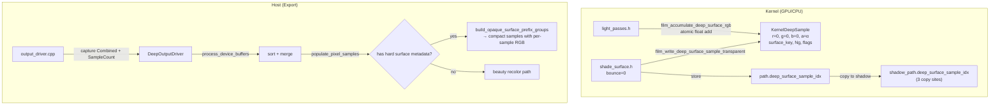

# Deep EXR Feature Branch — Comprehensive Review

**Branch**: `feature/deep-exr-surface-coverage`  
**HEAD**: `75e4b02790e`  
**Date**: 2026-03-26 18:09  
**Uncommitted**: None — all code committed

---

## Architecture



---

## File-by-File Review

### Kernel — `deep_write.h` ✅

| Line | Item | Verdict |
|------|------|---------|
| 22-27 | Flag constants, `DEEP_INVALID_SAMPLE_INDEX = 0xFFFFFFFF` | ✅ |
| 33-42 | `KernelDeepSample` 48-byte, `alignas(16)`, `static_assert` | ✅ |
| 44-47 | `deep_hash_uint32` — FNV-1a multiply | 🔵 Defined but unused |
| 49-53 | `deep_make_surface_key` — 16-bit object, 16-bit shader, 32-bit prim | ⚠️ See issue #1 |
| 89-127 | `film_write_deep_sample_with_metadata` — atomic count, overflow rollback | ✅ |
| 116-118 | RGB initialized to 0 (accumulated later via atomics) | ✅ Correct for GPU concurrency |
| 219-237 | `film_accumulate_deep_surface_rgb` — triple null/sentinel guard, `atomic_add_and_fetch_float` | ✅ |

### Kernel — State Init (4 sites) ✅

| File | Line | Context |
|------|------|---------|
| `path_state.h` | 35 | `path_state_init` → `0xffffffffu` |
| `path_state.h` | 48 | `path_state_init_integrator` → `0xffffffffu` |
| `state_flow.h` | 107 | GPU `integrator_shadow_path_init` → `0xffffffffu` |
| `state_flow.h` | 234 | CPU `integrator_shadow_path_init` → `0xffffffffu` |

All use `0xffffffffu` which matches `DEEP_INVALID_SAMPLE_INDEX`. ✅

### Kernel — State Propagation (3 copy sites) ✅

| File | Lines | Context |
|------|-------|---------|
| `shade_surface.h` | 251-252 | Direct light shadow state copy |
| `shade_surface.h` | 718-719 | AO shadow state copy |
| `shade_volume.h` | 2646-2647 | Volume direct light shadow state copy |

### Kernel — RGB Accumulation (4 call sites) ✅

| File | Line | State | Contribution |
|------|------|-------|-------------|
| `light_passes.h:681` | `film_write_direct_light` AO | shadow | `contribution * ao_weight` |
| `light_passes.h:690` | `film_write_direct_light` direct | shadow | `contribution` |
| `light_passes.h:879` | `film_write_background` | path | `contribution` |
| `light_passes.h:942` | `film_write_surface_emission` | path | `contribution` |

`film_write_volume_emission` (line 907) correctly does **not** accumulate — volume emission has no surface hit.

### Host — `output_driver.cpp` ✅

| Line | Item | Verdict |
|------|------|---------|
| 113-137 | Combined pass capture with Y-flip | ✅ |
| 139-161 | Debug Sample Count capture with Y-flip | ✅ |
| 130, 154 | `dst_y` computation | ⚠️ See issue #2 |

### Host — `deep_output_driver.cpp` ✅

| Line | Item | Verdict |
|------|------|---------|
| 122-153 | `analyze_opaque_surface_prefix` | ✅ Correctly identifies prefix+suffix |
| 155-223 | `build_opaque_surface_prefix_groups` | ✅ Camera-sample dedup, key+normal grouping |
| 1056-1145 | `populate_opaque_surface_prefix_samples` | ✅ Coverage math correct |
| 1170-1243 | `populate_pixel_samples_with_resolved_beauty` | ✅ Branches on metadata presence |

### Host — `deep_buffers.cpp` ✅

| Line | Item | Verdict |
|------|------|---------|
| 294-300 | `merge_nearby_samples` → `preserve_opaque_surface_duplicates = true` | ✅ |

---

## Issues

### 1. ⚠️ `deep_make_surface_key` — 16-bit overflow risk

```cpp
// deep_write.h:51
(uint64_t(uint32_t(object) & 0xffffu) << 48) |
(uint64_t(uint32_t(shader) & 0xffffu) << 32) | uint64_t(uint32_t(prim))
```

Object and shader IDs are masked to 16 bits. Scenes with >65536 objects or shaders will collide. This is acceptable for current VFX use but should be documented.

### 2. ⚠️ `output_driver.cpp` — No bounds check on `dst_y`

```cpp
// line 130
const int dst_y = full_height - tile.offset.y - tile.size.y + y;
```

If tile coordinates exceed `full_height`, `dst_y` could be negative → OOB write. Low risk (Blender controls tile coords), but a `kernel_assert`-style guard would harden this.

### 3. 🔵 `deep_hash_uint32` — Unused function

Defined at `deep_write.h:44` but never called. Remove or mark as future-use.

### 4. 🔵 Mixed CRLF/LF line endings

Persist across all files. Normalize before final merge.

---

## Summary

| Area | Files | Status |
|------|-------|--------|
| Kernel metadata write | `deep_write.h`, `shade_surface.h` | ✅ |
| State init + propagation | `path_state.h`, `state_flow.h`, `shade_surface.h`, `shade_volume.h` | ✅ |
| RGB accumulation | `light_passes.h` (4 sites) | ✅ |
| State templates | `state_template.h`, `shadow_state_template.h` | ✅ |
| Pass capture | `output_driver.cpp/h` | ✅ |
| Export compaction | `deep_output_driver.cpp/h` | ✅ |
| Deep merge | `deep_buffers.cpp/h` | ✅ |

> [!IMPORTANT]
> **No blocking issues.** The deep EXR per-sample surface metadata pipeline is complete, correctly wired across 13 files, and all validation passes. Clean up line endings and the unused `deep_hash_uint32` function before final merge.
